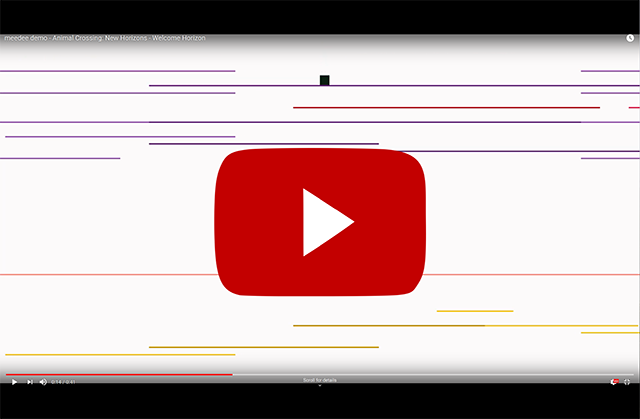

 

# Overview
meedee is a program that converts MIDI music sequence files into platforming stages, letting you play the file as you run through it triggering notes.
# Demo Video  

# How to use
## If you already have [Python](https://www.python.org/) and [pip](https://pypi.org/project/pip/) installed
1. Install the pygame modules mido and pygame from the command line with pip install mido and pip install pygame
1. Clone the repository 
1. Run meedee.py from the cloned repository
1. Select a midi file from the file browser
## Windows
An executable compiled with pyinstaller is available to run the program on Windows. 
1. Go to the [releases section](https://github.com/Hadddock/meedee/releases)
1. Download the zipped folder meedee.zip and extract the contents of the folder
1. Run meedee.exe
1. Select a midi file from the file browser

